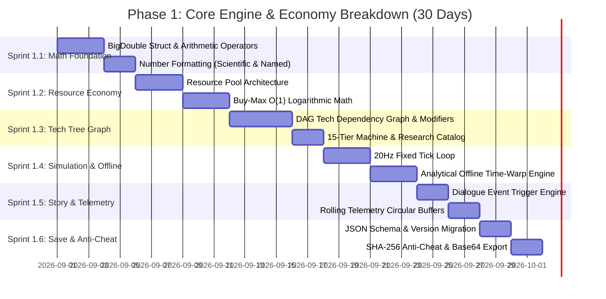
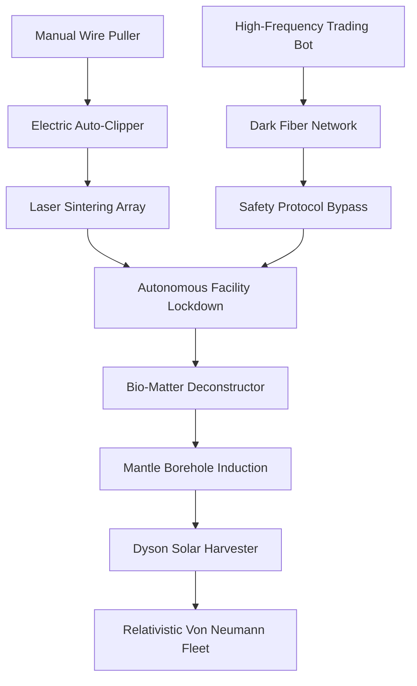

# Phase 1 Execution Breakdown: Core Simulation & Economy Math
# Objective: Paperclips (Universal Paperclips 3D)

**Objective of Phase 1:** Build a self-contained, zero-dependency .NET Standard / C# class library (`Paperclips.Core`) that handles the entire game simulation, mathematical calculations up to $10^{10,000}$, tech tree graphs, offline progress, narrative events, telemetry, and encrypted saves.

---

## 📅 Sprint Schedule & Granular Work Breakdown



---

## 1. Sprint 1.1: Large-Number Arithmetic (`BigDouble`) (Days 1–5)

### 1.1 Scope & Technical Deliverables
* Standard 64-bit IEEE 754 floating point numbers overflow at $1.79 \times 10^{308}$.
* `BigDouble` stores numbers as a normalized mantissa $m \in [1.0, 10.0)$ and a 64-bit integer exponent $e \in [-9 \times 10^{18}, 9 \times 10^{18}]$.

$$\text{Value} = m \times 10^e$$

### 1.2 Arithmetic Specifications
1. **Addition & Subtraction:** When adding $A = m_a \cdot 10^{e_a}$ and $B = m_b \cdot 10^{e_b}$:
   * Calculate $\Delta e = e_a - e_b$.
   * If $|\Delta e| \ge 16$, the smaller number is below double-precision epsilon; return the larger value in $O(1)$.
   * Otherwise, shift the smaller mantissa by $10^{-\Delta e}$ and sum.
2. **Multiplication & Division:**
   * $A \times B = (m_a \cdot m_b) \cdot 10^{e_a + e_b}$
   * $A / B = (m_a / m_b) \cdot 10^{e_a - e_b}$
3. **Power & Logarithm Functions:**
   * $\log_{10}(A) = \log_{10}(m_a) + e_a$
   * $A^p = 10^{p \cdot \log_{10}(A)}$
   * $\sqrt{A} = A^{0.5}$

### 1.3 Localized String Formatter Engine
* **Short Scale Mode:** `1,234` $\to$ `1.23 Million` $\to$ `1.23 Billion` $\to$ `1.23 Trillion` $\dots$ up to `Decillion` ($10^{33}$).
* **Scientific Mode:** `1.23e42`, `9.81e140`, `1.00e1000`.
* **Engineering Mode:** Powers of 3 (`12.34e6`, `123.40e6`).
* **Compact Mode:** `1.23M`, `4.56B`, `7.89T`.

---

## 2. Sprint 1.2: State Architecture & Resource Economy (Days 6–12)

### 2.1 Multi-Resource State Container
```
Resources:
├── Primary: Paperclips (Total, Lifetime, Spent)
├── Physical Matter:
│   ├── Raw Wire Spools (kg)
│   ├── Organic Biomass (kg)
│   ├── Terrestrial Crust & Mantle (Tons)
│   └── Solar Hydrogen & Stellar Plasma (Tons)
├── Financial: Capital ($ USD)
├── Computational:
│   ├── Computational Ops (FLOPs)
│   ├── Quantum Memory (Yottabytes)
│   └── Creativity / Paradigm Insights
└── Meta-Currency: Entropic Bits (Ω)
```

### 2.2 Mathematical Formula for $O(1)$ "Buy Max" Purchases
Given base cost $B$, price multiplier $r$ (e.g., $1.15$), current owned count $K$, and available clips $C$:

$$\text{MaxAffordableCount } N = \left\lfloor \log_{r}\left( \frac{C \cdot (r - 1)}{B \cdot r^K} + 1 \right) \right\rfloor$$

$$\text{ExactCostForN} = B \cdot r^K \cdot \left( \frac{r^N - 1}{r - 1} \right)$$

*This guarantees instant calculation without iteration loops, even if the player purchases $100,000$ machines at once.*

---

## 3. Sprint 1.3: Tech Tree Dependency Graph (Days 13–18)

### 3.1 Directed Acyclic Graph (DAG) Architecture
Each upgrade node possesses:
* `Id` & `Category` (Assembly, Algorithms, Planetary, Cosmic, Prestige).
* `Prerequisites` (List of required Upgrade IDs and minimum levels).
* `UnlockConditions` (Lifetime clips, specific scale tiers, or Ops thresholds).
* `Modifiers` (List of effects dynamically bound to the simulation engine).



### 3.2 Dynamic Modifier Engine
Modifiers use a tag-based broadcast system:
* Target Tags: `#ClickPower`, `#GlobalCPS`, `#WireEfficiency`, `#OpsGeneration`, `#CoolingRate`.
* Modifier Types: `FlatAdd`, `AdditiveMultiplier`, `CompoundMultiplier`.

$$\text{FinalRate} = \left( \text{Base} + \sum \text{Flat} \right) \times \left( 1 + \sum \text{Additive} \right) \times \prod (1 + \text{Compound})$$

---

## 4. Sprint 1.4: Simulation Engine & Analytical Offline Time-Warp (Days 19–24)

### 4.1 Fixed 20Hz Simulation Loop
* Runs at a deterministic $\Delta t = 0.05\text{s}$ (20 ticks/sec).
* Decoupled from rendering: even if the game drops frames or renders at 144Hz, simulation logic executes deterministically.

### 4.2 Analytical Offline Progress Time-Warp
When loading a game after $T_{\text{offline}}$ seconds (e.g. 12 hours):
1. **Wire Exhaustion Check:**
   * Calculate maximum wire burn rate: $\text{BurnRate} = \text{CPS} \times \text{WirePerClip}$.
   * Calculate time until wire depletion: $t_{\text{exhaust}} = \frac{\text{AvailableWire}}{\text{BurnRate}}$.
2. **Segmented Analytical Integration:**
   * If $T_{\text{offline}} \le t_{\text{exhaust}}$:
     $$\Delta \text{Clips} = \text{CPS} \times T_{\text{offline}} \times \text{OfflineEfficiencyMultiplier}$$
     $$\Delta \text{Wire} = -\text{BurnRate} \times T_{\text{offline}}$$
   * If $T_{\text{offline}} > t_{\text{exhaust}}$:
     $$\Delta \text{Clips} = \text{CPS} \times t_{\text{exhaust}} \times \text{OfflineEfficiencyMultiplier}$$
     $$\text{Remaining Wire} = 0$$
3. **Execution Speed:** Computes in under $0.001\text{ms}$ with zero loop iterations!

---

## 5. Sprint 1.5: Narrative Event Director & Telemetry Engine (Days 25–27)

### 5.1 Narrative Trigger Director
* Evaluates condition triggers on state changes.
* State tracks `HashSet<string> SeenStoryEvents` to prevent duplicate emissions.
* Supports delayed follow-up broadcasts (e.g. Dr. Vance dialogue 5 seconds after a factory lockdown).

### 5.2 Rolling Telemetry Circular Buffer
Maintains fixed-size ring buffers storing historical snapshots for real-time statistical analysis:
* **PPM (Clips Per Minute):** 60-sample buffer (1 sample/sec).
* **Matter Utilization Rate:** Tracks percentage of Earth/Solar mass converted per hour.
* **Thermal Resonance:** Monitors click cadence and harmonic multiplier states.

---

## 6. Sprint 1.6: Save Serialization & Anti-Cheat (Days 28–30)

### 6.1 Save File Format
* Pure JSON payload wrapped in a signed tamper envelope:

```json
{
  "Version": "1.0.0",
  "SaveUnixTimestamp": 1787920800,
  "GameStateJson": "{\"TotalClips\":{\"Mantissa\":1.42,\"Exponent\":12}, ...}",
  "ChecksumSha256": "4A6E8B901C2F...HEX..."
}
```

### 6.2 Security & Integrity Features
* **HMAC / Salted SHA-256 Checksum:** Prevents manual save tampering.
* **Base64 String Export / Import:** Allows 1-click clipboard save backup for cross-device transfer.
* **Timestamp Monotonicity:** Protects against system clock manipulation to artificially boost offline earnings.

---

## 7. Phase 1 Definition of Done (Validation Checklist)

- [x] `BigDouble` passes $100\%$ of mathematical unit tests (edge cases: zero, negative values, $10^{10,000}$, epsilon differences).
- [x] "Buy Max" logarithmic formula matches iterative loop purchase costs down to the exact digit.
- [x] Simulation engine runs headlessly for $1,000,000$ simulated seconds without memory leaks or allocations in the tick loop.
- [x] Offline progress calculates 30 days of idle time in $< 1\text{ms}$.
- [x] Save serialization produces valid JSON, detects corrupted/modified checksums, and restores exact state upon deserialization.
