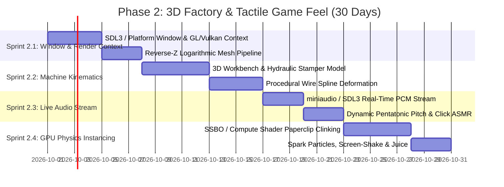

# Phase 2 Execution Breakdown: 3D Factory Prototype, Tactile Micro-Loop & GPU Physics
# Engine: *OmniClip Engine* (Custom C++20 / GLSL / Vulkan / OpenGL)

**Goal of Phase 2:** Build the interactive 3D factory workbench, wire-bending kinematics, GPU instanced physics clips, live low-latency audio stream, and visceral sensory feedback ("The Crunchy Micro-Loop").

---

## 📅 Phase 2 Sprint Schedule (Days 31–60)



---

## 1. Sprint 2.1: Windowing & Interactive 3D Render Context (Days 31–37)

### 1.1 Deliverables
* **Platform Window Creation:** Initialize native high-DPI window (Windows Win32/DirectInput, Linux X11/Wayland) with modern resize handling and full-screen toggling.
* **Modern Graphics Pipeline:** Setup rendering context supporting instanced rendering (`glDrawElementsInstanced` / `vkCmdDrawIndexedIndirect`).
* **Interactive Orbit Camera:** Smooth mouse orbit (right click), pan (middle click), and continuous logarithmic scroll zoom.

---

## 2. Sprint 2.2: 3D Machine Kinematics & Procedural Wire Bending (Days 38–46)

### 2.1 The Wire-Bending Mechanical Loop
Every click executes a 3-stage mechanical cycle ($0.16\text{s}$ total duration):
1. **Stage 1 - Wire Feed ($0.04\text{s}$):** Rollers rotate, extending straight wire from the coil through the guide die.
2. **Stage 2 - Hydraulic Slam ($0.08\text{s}$):** Dual steel mandrel pins engage, folding the wire into the iconic inner and outer paperclip loops with squash-and-stretch recoil.
3. **Stage 3 - Shear Cut & Ejection ($0.04\text{s}$):** Carbide shear blade snaps the wire; pneumatic blast shoots the completed clip forward.

```
[Wire Coil] ---> [Feed Rollers] ---> [Bending Mandrel Pins] ---> [Carbide Shear] ---> [Ejection Blast]
```

### 2.2 Procedural Spline Generation
The paperclip geometry is generated dynamically from a continuous 3D Bezier spline with 4 concentric semi-circular arcs:

$$\mathbf{B}(t) = (1-t)^3 \mathbf{P}_0 + 3(1-t)^2 t \mathbf{P}_1 + 3(1-t) t^2 \mathbf{P}_2 + t^3 \mathbf{P}_3$$

---

## 3. Sprint 2.3: Live Low-Latency Audio Stream (Days 47–52)

### 3.1 PCM Audio Callback Integration
* Integrate `miniaudio` (single-header C audio library) to drive the sound device with $< 5\text{ms}$ buffer latency.
* Direct connection to `ProceduralAudioEngine`: clicking triggers synthetic FM physical chimes directly in the stream callback with zero disk I/O.
* **Combo Escalation:** Successive clicks within $1.2\text{s}$ advance the pitch up the 11-step pentatonic scale (C4 $\to$ C6).

---

## 4. Sprint 2.4: GPU Physics Instancing & "Juice" (Days 53–60)

### 4.1 100,000 GPU-Simulated Physics Clips
* Paperclips accumulate physically in collection bins on the workbench.
* Physics calculated in a lightweight **GPU Compute Shader** (`physics_particles.comp`):
  * Rigid-body bounding capsule approximation.
  * Floor, hopper wall, and plexiglass shield collisions.
  * Inelastic bounce and frictional settling.

### 4.2 Sensory Juice & Feedback Layer
* **Dynamic GPU Sparks:** Laser sintering and shear cutting emit 60–120 glowing spark particles with gravity and metallic bounce.
* **Micro Screen-Shake:** Traumatic directional shake proportional to machine horsepower.
* **Floating 3D Number Popups:** Crisp SDF-rendered numbers (`+1`, `+10`, `CRITICAL SNAP!`) that drift upward with dynamic spring physics.

---

## 🎯 Phase 2 "Definition of Done" Checklist

- [ ] Window opens instantly on Windows and Linux with 144Hz V-Sync.
- [ ] Clicking on the 3D machine triggers snappy procedural hydraulic animations and ejection.
- [ ] Procedural FM audio plays with zero perceived latency, rising in pitch during click combos.
- [ ] Over 50,000 active paperclips clink and settle into physical bins with $> 60\text{ FPS}$.
- [ ] Interactive camera orbits smoothly around the workbench with continuous zoom.
