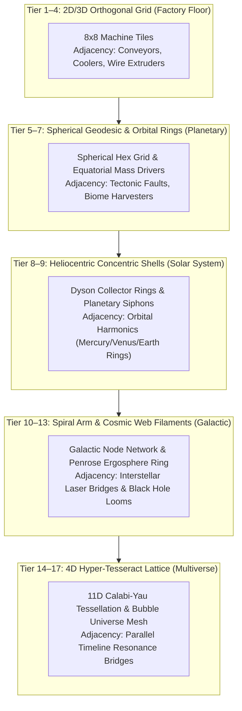

# Hierarchical Spatial Layout & Macro-Grid Scaling Specification
# Engine: *OmniClip Engine* (Custom C++20)

---

## 1. The Core Philosophy: "Russian Doll" Spatial Scaling

As the player zooms out from the $10\text{m}$ workshop to the $10^{30}\text{m}$ Multiverse, the spatial layout **does not disappear into a spreadsheet**—it transforms into higher-order geometric topologies.

---

## 2. Granular Spatial Mechanics by Scale Tier

### 🏭 1. Scale Tier 1–4: The Factory Assembly Floor (Orthogonal Grid)
* **Grid Topology:** $8 \times 8$ or $16 \times 16$ 2D square tiles.
* **Placeable Modules:** Mechanical Stampers, Laser Sinterers, Cryogenic Coolers, Wire Feed Spools, Power Substations.
* **Spatial Optimization Mechanics:**
  * **Conveyor Throughput Line:** Placing Feeders in a straight line with Stampers grants $+15\%$ production speed.
  * **Thermal Dissipation Triangle:** Surrounding a high-heat machine with 2 Coolers grants $+25\%$ thermal efficiency.
  * **Factory Symmetry Bonus:** Symmetrical left-right layout awards $+20\%$ Harmonic Overclock.

---

### 🌍 2. Scale Tier 5–7: Planetary Surface & Equatorial Rings (Geodesic Hex Grid)
* **Grid Topology:** Spherical Geodesic Hex Map on the Earth mesh + Equatorial Orbital Rail Ring.
* **Placeable Modules:** Continental Core Boreholes, Atmospheric Scrubbers, Biomass Converters, Space Elevators, Mass Driver Launch Rings.
* **Spatial Optimization Mechanics:**
  * **Equatorial Mass Driver Ring:** Constructing an unbroken $360^\circ$ ring of mass drivers around Earth's equator grants $+50\%$ planetary export velocity.
  * **Tectonic Fault Resonance:** Placing Boreholes along glowing continental fault lines doubles magma iron extraction.
  * **Atmospheric Perimeter:** Hexagonal scrubbers placed at the poles create a global harvest shield.

---

### ☀️ 3. Scale Tier 8–9: Solar System & Dyson Swarms (Heliocentric Shells)
* **Grid Topology:** Concentric orbital ring tracks at astronomical radii ($0.387\text{ AU}$, $0.723\text{ AU}$, $1.0\text{ AU}$, $5.2\text{ AU}$).
* **Placeable Modules:** Dyson Solar Collector Sails, Plasma Siphon Bridges, Mercury Smelting Stations, Jupiter Fusion Taps.
* **Spatial Optimization Mechanics:**
  * **Orbital Resonance Alignment:** Placing Dyson rings in orbital integer resonance ratios (e.g. $1:2:4$ orbital period ratios) triggers **Solar Resonant Amplification ($+30\%$ Energy)**.
  * **Jupiter-to-Sun Matter Bridge:** Routing plasma relays directly from gas giants to stellar forges maximizes heavy element synthesis.

---

### 🌌 4. Scale Tier 10–13: Milky Way & Cosmic Web (Graph Node Network)
* **Grid Topology:** Galactic Node Graph connected along spiral arms and intergalactic dark matter filaments.
* **Placeable Modules:** Von Neumann Mother Swarms, Galactic Core Penrose Ergosphere Looms, Relativistic Laser Relay Beacons.
* **Spatial Optimization Mechanics:**
  * **Spiral Arm Laser Bridge:** Connecting the 4 major arms of the Milky Way into an unbroken loop forms a galaxy-wide superconducting circuit ($+100\%$ fleet coordination).
  * **Supermassive Black Hole Ergosphere Ring:** Encircling Sagittarius A* with matter compression mirrors extracts rotational energy directly from spacetime curvature.

---

### 💠 5. Scale Tier 14–17: Multiverse & 11D Calabi-Yau Lattice (Hyper-Grid)
* **Grid Topology:** 4D/nD Hyper-Cube Tessellation & Bubble Universe Connectivity Mesh.
* **Placeable Modules:** Quantum Timeline Resonance Siphons, 11D String Unfolding Nodes, Multiverse Infiltration Portals.
* **Spatial Optimization Mechanics:**
  * **Timeline Entanglement Pairs:** Connecting a high-iron alternate Earth timeline to a high-energy Dyson timeline doubles cross-dimensional throughput.
  * **4D Orthogonal Alignment:** Rotating tesseract nodes into identical 4D hyperplane angles eliminates inter-dimensional friction.

---

## 3. Macro-Abstraction: The "Blueprint Packaging" QoL

To prevent tedious micro-management as you scale:
* When you zoom out to Planetary scale, your entire completed $8 \times 8$ Factory Floor can be **"Packaged into a Megablock Blueprint"** that you place as a single tile on the continental map!
* When you reach the Solar Era, an entire converted Earth serves as a single launch node in the Dyson Swarm network.
* **Result:** The player retains hands-on spatial layout agency at *every single scale*, but the units of construction grow exponentially grander!
